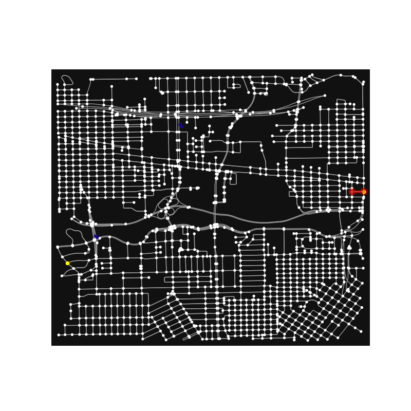

# GraphRouteOptimizationRL
Not finished yet, stay tune. 
# demo

# References:
+ https://github.com/instance01/osmnx-mdp | visizulation
+ https://github.com/nathanrooy/taxicab | nearest point optimization
+ https://github.com/dnoursi/gym-graph-search | gym openai graph
+ https://github.com/deepmind/ai-safety-gridworlds | AI saftly navigation 
  - https://arxiv.org/pdf/1711.09883.pdf
+ https://www.proquest.com/docview/2541954632?pq-origsite=gscholar&fromopenview=true
